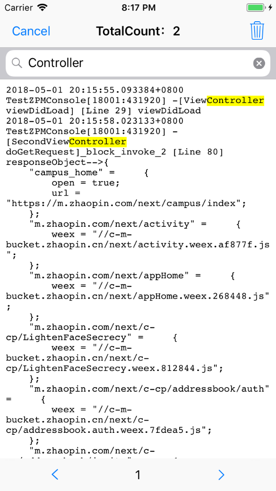

# ZPMConsoleLog

### 预览图

 

### 安装方法
```
pod 'ZPMConsoleLog'
```

### 使用方法

基本用法
```
#import "ZPMLog.h"

[[ZPMLog shareInstance] showConsoleWindow];
```

进阶用法
如果你需要随时打开或关闭日志记录，可以使用openNSLogToDocumentFolder和closeNSLogToDocumentFolder。
```
// 打开记录到日志文件，打开后，xcode控制台将不会显示出信息
[[ZPMLog shareInstance] openNSLogToDocumentFolder];

// 关闭记录到日志文件，关闭后，xcode控制台将会显示出信息
[[ZPMLog shareInstance] closeNSLogToDocumentFolder];
```

如果你想自定义日志存放路径，可以修改filePath
```
[[ZPMLog shareInstance] setFilePath:@"你的文件完整路径"];
```
